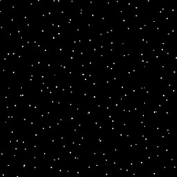
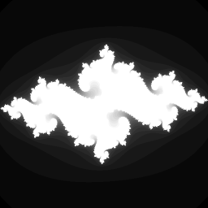

# transduce-bend

A Bend library for composing pure data transformations without intermediate
stage collections. It provides an owned reducer protocol, extensible
source-owned reduction, map/filter/keep/take/drop and their predicate-based
variants, indexed mapping and selection, partitioning and windows, mapcat/cat,
adjacent deduplication and interposition, and sum/count/ordered-list consumers.
Built-in sources are lists, Bend arrays, finite ranges, strings, and Vec;
other modules can add sources without changing this library.

**Start with the [single-file public API guide](docs/current/20260925-PUBLIC-API.md).**
It lists every supported stage, source, destination, adapter, and extension
point, and distinguishes them from implementation helpers.

## Bullet Cathedral: a transducer bullet hell


**[Watch the 120-frame animation](bench/bullet-cathedral.mp4).** A Bend
transducer program generates up to 12,288 live bullets, resolves swept-circle
collisions against 256 moving shield drones and a moving player, and renders
every pixel of a 512×512 arena. Its fused stages expand each friendly bullet
to nine nearby grid cells with `cat`, filter precise hits, update drone health,
then expand glowing sprites into pixels and blend them into a flat Bend Array.
The boss changes color, hits leave afterglows, and the HUD tracks damage and
player shield. No input file or external art is required.

To watch the CPU-rendered simulation at **1920×1080 for 30 minutes**, run:

```sh
python3 bench/bullet_cathedral_2k_native.py
```

The [native 2K player](bench/bullet_cathedral_2k_native.py) compiles one Bend
executable, renders each 1920×1080 frame on one CPU thread, and presents it in
a macOS window as soon as it is ready. There is no selected playback FPS; the
window title and terminal report measured FPS. Each 240-frame shield wave
restarts while the bullet clock continues. The run lasts 30 minutes by wall
clock; close the window or press Escape to stop sooner. Use `--minutes 60` for
an hour or `--window-width 1920` for a full-size window. It needs `bun`,
`clang`, Python 3, macOS, and the sibling `../bend` checkout. Metal copies the
finished CPU framebuffer to the window; all simulation and pixel rendering
remain in Bend on the CPU. The older [ffplay stream](bench/bullet_cathedral_2k_live.py)
and [512×512 player](bench/bullet_cathedral_live.py) remain available.

On an M3 Max, one native CPU thread computed the complete 120-frame sequence
in a **439 ms median** over 21 runs, including simulation, collision handling,
RGB framebuffer generation, and pixel checksums. That is about **273 computed
frames per second averaged over the sequence**; MP4 encoding and display are
outside the timed interval. An independent exhaustive oracle checked 54
million bullet–drone pairs and matched Bend's collision counters at every
frame. See the [source, stills, performance samples, and reproduction
steps](bench/BULLET-CATHEDRAL.md).

An [array-per-bullet-field experiment](bench/BULLET-LAYOUT-EXPERIMENT.md)
compares this generated-bullet stream with stored arrays of records and seven
separate field arrays. The field arrays match every frame and save about 4%
of complete one-thread runtime. Simulation is only about 11% of that runtime;
framebuffer work dominates.

Changing the original programs from one to [2, 4, or 8 CPU threads](bench/BULLET-THREAD-SCALING.md)
does not improve the 120-frame time: the field-array medians stay at about
393 ms. A [parallel frame-batch variant](bench/BULLET-PARALLEL-FRAMES.md)
first advances the dependent game state in order, then renders eight independent
frame snapshots with balanced parallel calls. On eight threads, its 120-frame
median is **95.7 ms**, versus **393.3 ms** for the serial field-array version:
**4.11× faster**. That is about **1,254 computed frames per second**, or
**0.80 ms per frame averaged over the batch**. This is batch throughput; it
does not measure the latency of rendering one frame or include video encoding
and display.

A [32-task tiled variant](bench/BULLET-TILED32.md) split each batch of eight
frames into four horizontal tiles per frame. It matched all frame checksums,
but took **115.1 ms at 16 threads**; the extra tasks did not beat the eight
full-frame render tasks.

At [3840×2160](bench/BULLET-4K-TILED16.md), two tiles per frame produce
**16 render tasks**. Over 120 frames, the tiled variant took **2.277 s at
16 threads**, compared with **2.634 s** for eight full-frame tasks at eight
threads. Both renderers matched every 4K frame checksum. The two tiles have
equal pixel counts, but the top tile carries more sprite work, which limits
the gain from adding workers. [View frame 96 at full 4K resolution](bench/bullet-cathedral-4k-frame-096.png).

A [CPU simulation plus Metal renderer experiment](bench/BULLET-GPU-COMPARISON.md)
bins sprites into spatial tiles and runs one GPU call per frame. It matches the
existing image, but the best tested 4K Metal draw takes **152 ms**, versus
**31 ms** on eight CPU threads. The long 2K player uses CPU rendering.

## Transformation-heavy showcase: an animated starfield



This no-input renderer computes four samples per pixel. Its public Bend
pipeline maps pixel IDs to small ranges, flattens them with `cat`, computes
sample brightness, groups each four values with `partition4`, averages them,
filters dark pixels, and sums a checksum. A frame number scrolls the field.
The arithmetic is short enough that moving intermediate data matters.

At **512×512 pixels (1,048,576 samples)**, median one-thread computation
times on an M3 Max were **0.64 ms fused Bend**, **0.58 ms direct Bend**,
**0.58 ms handwritten C**, **3.73 ms when only final Bend pixels are
materialized**, **7.77 ms with Array-backed Vec stages**, and **15.58 ms
with every stage materialized as a Bend List**. The fused path made 32 timed
native heap allocation calls versus about 5 million for the staged Lists.
All checksums agree, and the Bend image matches C pixel for pixel.

At 1024×1024, eight CPU threads computed a frame in **0.44 ms**; Metal with
4,096 tiles took **0.49 ms**. These times exclude image export and display.
The [full starfield report](bench/STARFIELD-SHOWCASE.md) includes the Bend,
C, List, and Vec code paths, scaling measurements, GPU tile sensitivity,
raw timings, and reproduction commands. The Julia-set renderer below remains
the heavier arithmetic example.

## Visual showcase: a supersampled Julia set



This self-contained renderer evaluates four samples per pixel, groups them
without a per-pixel List, and reduces visible shades to a checksum. A frame
number moves the Julia parameter, so it needs no input file. The pipeline is
the full processing path:

```bend
X.transduce(X.comp2(X.comp5(
  X.map(~U32, ~T.Range, ~pixel_samples),
  X.cat(T.Range.adapter()),
  X.map_with(~U32, ~U32, ~Render, ~sample, config),
  X.partition4(~U32),
  X.map(~(U32 & U32 & U32 & U32), ~U32, ~shade)),
  X.filter(~U32, ~visible)),
  X.sum_rf(), 0, T.range(pixels))
```

At 512×512, that is **1,048,576 complex-orbit samples per frame**. The
transducer, direct Bend loop, two materialized Bend paths, and handwritten C
renderer all produce the same checksum; the exported Bend image also matches
C pixel for pixel. On an M3 Max, median single-thread CPU computation times
were **37.40 ms fused Bend**, **37.43 ms direct Bend**, **38.28 ms when only
final pixels are materialized**, **51.72 ms when every stage is materialized**,
and **15.64 ms handwritten C**. The fully staged path made 5,074,355 timed
native heap allocation calls, versus 32 for fusion. A cheap-mapper control
with the same stage layout measures 0.18 ms fused versus 15.19 ms staged:
the Julia orbit math hides most of the intermediate-data cost.

Balanced tiles let Bend use CPU threads or the GPU. With eight distinct
frames timed after a warm-up, 512×512 medians were **7.50 ms per frame on
eight CPU threads** and **0.82 ms on the GPU with 4,096 tiles**. These are
computed frames: image export, display, process startup, and shader
compilation are outside the interval. The [full showcase and reproduction
commands](bench/JULIA-SHOWCASE.md) include the C code, materialized control,
tile-count sensitivity, checksums, and raw samples.

## Showcase: map, filter, and sum a flat Array

All five implementations use the same values at each tested size, up to
1,048,576 `U32` elements. They apply the same two-multiply, two-xor
transform, keep values whose low byte is below 96, and sum with `U32`
wraparound. The input is built before timing. These are the processing cores;
the shared helpers and complete programs are in the
[Bend fixture](bench/public_array_map_filter_sum.bend) and
[handwritten C fixture](bench/public_array_map_filter_sum.c).

The **Bend transducer** says exactly which stages to compose. Its raw Array
source reads the flat storage with indexed `Array.get`:

```python
def transducer(xs: Array<U32>) -> U32:
  X.transduce(X.comp2(X.map(~U32, ~U32, ~transform),
    X.filter(~U32, ~keep)), X.sum_rf(), 0, xs)
```

The **direct Bend** version performs the same operations in an indexed loop:

```python
def add_kept(acc: U32, x: U32, flag: Bool) -> U32:
  match flag:
    case True{}: U32.add(acc, x)
    case False{}: acc

def direct_step(got: Array<U32> & U32, acc: U32) -> Array<U32> & U32:
  (xs, value) = got
  +mapped = transform(value)
  (xs, add_kept(acc, mapped, keep(mapped)))

def direct_loop(left: Nat, pair: Array<U32> & U32, +index: U32) -> U32:
  match left:
    case 0n:
      (xs, acc) = pair
      acc
    case 1n+p:
      (xs, acc) = pair
      direct_loop(p, direct_step(Array.get(U32, xs, index), acc),
        U32.inc(index))
```

The **manual C** version uses the same transform and predicate in a pointer
loop (`values` is a contiguous `uint32_t*`):

```c
uint32_t sum = 0;
for (size_t i = 0; i < count; ++i) {
  uint32_t mapped = transform(values[i]);
  if ((mapped & UINT32_C(255)) < UINT32_C(96)) sum += mapped;
}
```

For comparison, **materialized Bend** computes the same sum in two ways:

```python
def array_mask(xs: Array<U32>) -> U32:
  mapped = Array.map(~U32, ~U32, ~transform, xs)
  masked = Array.map(~U32, ~U32, ~mask, mapped)
  sum_sized(Array.size(U32, masked))

def list_materialized(xs: Array<U32>) -> U32:
  mapped = Array.map(~U32, ~U32, ~transform, xs)
  values = Array.to_list(~U32, mapped)
  kept = filter_list(values)
  List.foldl(~&1, ~U32, ~U32, ~U32.add, kept, 0)
```

The Array mask represents rejected values as zero, which is equivalent for
this sum but retains every slot. The List path creates a compact filtered
collection and also pays for Array-to-List conversion.

On an M3 Max, one native CPU thread, Apple Clang 17 `-O3`, the medians of 36
randomized runs were **microseconds**:

| Elements | Bend transducer | Direct Bend | Manual C | Array mask | List filter |
| ---: | ---: | ---: | ---: | ---: | ---: |
| 65,536 | 23 | 15 | 12 | 119 | 1,026 |
| 262,144 | 89 | 61 | 45 | 461.5 | 4,091.5 |
| 1,048,576 | 352 | 243 | 178 | 1,849.5 | 16,422 |

All five paths matched an independent checksum. Traversal and input cleanup
are timed; input construction, compilation, and process startup are not. The
fused transducer made 10 timed native heap allocation calls at one million
elements, compared with 9 for direct Bend and 3,539,023 for the List path.
See the [methodology and raw samples](bench/PUBLIC-ARRAY-VS-C.md), and the
[bounded Array walk proposal](docs/current/20260926-BOUNDED-ARRAY-WALK.md)
for the remaining native optimization. Reproduce the current results with:

```sh
python3 bench/public_array_map_filter_sum.py --depths 16 18 20 --sessions 36 --output /tmp/public-array.json
```

## Public transducer API

[`xf.bend`](xf.bend) exposes Clojure-ordered
`transduce(xf, rf, initial, source)` and `into(destination, xf, source)`.
Stages compose with `comp2` through `comp5`. A stage value owns its runtime
settings and is used once; wrap a stage constructor in a zero-argument function
when it needs to be recreated. A source supplies its own reduction loop through
a `.source` companion, and a destination supplies a reducer through `.destination`.
Lists, Arrays of `Data` elements, finite ranges, strings, `Vec`, and
`VecMaybe` are built in. The Array source reads its flat storage by index;
affine Array elements have an explicit consuming source.

```python
import Base
import ./xf.bend as Xf
import ./transduce_core.bend as T

def inc(x: U32) -> U32:
  U32.inc(x)

def main() -> U32:
  Xf.transduce(Xf.comp2(
    Xf.map(~U32, ~U32, ~inc), Xf.take(~U32, 5n)),
    Xf.sum_rf(), 0, T.range(10))
# 15
```

The compiler selects source and destination companions. This requires the
[`codex/transducer-no-stop` branch](https://github.com/petterik/bend/tree/codex/transducer-no-stop)
of the `petterik/bend` fork, based on `bendlang/main`. The tested commit is
`1b4f641b9fea9b48fee37fc10b0a07977bba6e7d`. Put both repositories in
the same parent directory so the library's scripts find `../bend`:

```sh
git clone https://github.com/petterik/bend.git bend
git -C bend checkout codex/transducer-no-stop
git clone https://github.com/petterik/transducers-bend.git transduce-bend
cd transduce-bend
python3 tests/run.py
python3 tests/public_differential.py
bun experiments/affine_xf/check_no_stop_cache.ts
```

The branch adds checked companion selection and a general
uninhabited-match-arm optimization. Fresh sibling clones at the pinned
compiler commit passed the three commands above on this machine.
The associated reducer permit in
[`transduce_core.bend`](transduce_core.bend) is `Empty` for a total pipeline
and `Unit` for a pipeline that can stop. Sources remain generic and return an
opaque accumulator; they cannot fabricate a downstream stop. `take`,
`take_while`, and `partition_all` can stop, while `map`, `filter`, `keep`,
`drop`, the indexed stages, `take_nth`, `cat`, and `mapcat` inherit the
downstream permit. `mapcat` drives the reducible fragment returned by its
mapping function and preserves a stop from the middle of that fragment.

`drop(n)` discards the first `n` owned items, including affine items.
`take_while(predicate)` stops the source at the first false result;
`drop_while(predicate)` discards only the initial matching run, then passes
every remaining item. Like `filter`, both predicate stages currently require
`Data` elements because the predicate inspects an item that may then be passed
downstream. The [traversal tests](tests/xf_public_traversal.bend) cover their
composition with `take` and the built-in and custom sources.

`map_indexed(f)` supplies a zero-based `Nat` index to `f`; `keep_indexed(f)`
uses the same indexes and consumes `Maybe` results. Both support affine input
values. `take_nth(n)` emits positions `0, n, 2n, ...`; our zero-interval
convention emits nothing but still traverses the source. Use
`take(0)` for immediate stopping. `cat` flattens reducible fragments and
preserves downstream stopping, including a stop inside a fragment. A source
owner supplies a zero-field adapter, so `cat(T.List.adapter(~U32))` or
`cat(T.Array.adapter(~U32))` can consume raw fragments. For mapping and
flattening, use `comp2(map(~A, ~List<B>, ~f), cat(T.List.adapter(~B)))`.
Custom sources can define their own `.adapter` alongside `.source`.
`mapcat` and `cat_drive` remain available when supplying a closed drive
directly. See the [indexed and cat tests](tests/xf_public_indexed_cat.bend).

`dedupe(~A, ~equal)` removes consecutive equal inputs; equality is a
caller-supplied template function, and a later recurrence of a value is still
emitted. `interpose(~A, separator)` inserts a separator between inputs, never
before the first or after the last. Both require `A: Data`: `dedupe` retains
the previous input while it forwards the current one, and `interpose` reuses
the separator. A downstream stop on a separator prevents the following input
from being forwarded. See the [adjacent-stage tests](tests/xf_public_dedupe_interpose.bend).

`into(List, ...)` prepends, following Clojure's `conj` order. For encounter
order, collect into [`Vec`](vec.bend) or [`VecMaybe`](vec_maybe.bend).
`Vec<T: Data>` is backed by Bend Array and uses a caller-provided filler for
unused capacity; `VecMaybe<T: Data>` stores optional slots when no filler is
available. `Data` includes reusable user-defined records, not only numbers.
Both are sources and destinations; `Vec.adapter(~A)` also lets
`cat` consume raw Vec fragments. `Vec.with_capacity` and
`VecMaybe.with_capacity` return `None` above the conservative 2²³-element
initial-reservation limit; dynamic growth follows Bend Array's runtime limits.
The constructors of both Vec types are currently visible across modules, so
callers should use their functions rather than fabricate inconsistent records.

```python
import Base
import ./xf.bend as Xf
import ./vec.bend as Vec

def inc(x: U32) -> U32:
  U32.inc(x)

def numbers() -> List<U32>:
  [1, 2, 3]

def main() -> U32:
  values = Xf.into(Vec.empty(~U32, 0),
    Xf.map(~U32, ~U32, ~inc), numbers())
  Xf.transduce(Xf.map(~U32, ~U32, ~inc), Xf.sum_rf(), 0, values)
# 12
```

`into` recognizes Vec as a destination and `transduce` recognizes it as a
source; neither needs an explicit adapter. Only `cat` needs
`Vec.adapter(~A)` to identify the type of fragments it will flatten. The
filler occupies unused slots and does not appear in the logical contents.

`partition_by(~A, ~K, ~key, ~equal)` groups consecutive equal keys into
ordered Lists. It requires `Data` inputs and keys because it computes a key
while retaining the input for its group. `windows(~A, width)` produces only
full, overlapping List windows; `windows(2)` on `[1, 2, 3]` emits `[1, 2]`
and `[2, 3]`. The zero-width convention stops before reading the source.
`windows2(~A)` and `windows3(~A)` emit adjacent tuples instead, avoiding List
window construction. All window stages require `Data` elements for overlap.
See the [window comparison](docs/current/20260925-GROUPING-WINDOWS-VEC-ADAPTER.md)
for measured native costs.

`partition_all` produces ordered List chunks and allocates those chunks. A
consumer that retains chunks must pay that cost, and even a consuming fold may
not remove it. `partition4` instead emits disjoint four-element tuples, drops
an incomplete tail, and supports affine elements without constructing a List
per group. The Julia showcase above uses it to combine four samples into one
pixel. `mapcat` over a List-producing callback similarly allocates the
fragment; a custom source can emit values directly. See the
[public mapcat test](tests/mapcat_public.bend) and the
[no-stop integration report](docs/current/20260925-NO-STOP-PUBLIC-INTEGRATION.md).
Vec is the preferred ordered destination for `Data` values, but it is not the
default internal buffer of `partition_all`. On the measured upstream-main
compiler, an Array-backed chunk buffer was slower than List at every tested
full-fold width from 3 through 64, and for retained chunks at widths 1, 2, 3,
and 8. See the [Array partition experiment](docs/current/20260923-ARRAY-PARTITION-EXPERIMENT-PLAN.md).
`partition_all` also accepts affine `Type` elements; the fast Vec API currently
requires `Data` elements because its flat `Array.new` uses a reusable filler.

For an owned List map-and-sum, the public transducer ran at approximately
handwritten fused-fold speed in local native measurements. At 65,536 items,
the medians were 68 µs for a direct Bend fold, 66 µs for `transduce`, and
252 µs for `List.map` followed by `List.foldl`. The direct and public paths
made the same number of timed native allocation calls; `List.map` made one
extra call per item. Timing varies by compiled layout and machine state, so
these are local results, not a universal speed guarantee. See the
[public List comparison](docs/current/20260925-PUBLIC-LIST-MAP-FOLD.md) for
the fixture, raw samples, other sizes, and limitations.
The new `drop → map_indexed → take_nth → sum` pipeline also avoids
per-element intermediate allocations, but its measured native timing ranges
from parity to a noticeable gap against a tuned direct fold across compiled
layouts. See the [new-stage benchmark](docs/current/20260925-TRAVERSAL-INDEXED-TRANSDUCERS.md)
before making a stronger performance claim for that composition.

## Legacy reducer API

The original explicit reducer API remains in [`transduce.bend`](transduce.bend)
for historical examples and benchmarks. The earlier value API is
[`xf_legacy.bend`](xf_legacy.bend). The [legacy API guide](docs/archive/20260925-LEGACY-REDUCER-API.md)
records their spelling; new pipelines should use `xf.bend`.

## Compiler and verification

The public value API targets the `codex/transducer-no-stop` branch of the
`petterik/bend` fork, based on `bendlang/bend:main`. It includes
checked template inference, owner companions, bounded static callback
specialization, and conservative unreachable-match-arm elimination. `bench/compiler/prepare_static.py` remains a historical,
isolated experiment against upstream; it does not change `../bend`.

```sh
python3 tests/run.py
python3 tests/public_differential.py
bun experiments/affine_xf/check_no_stop_cache.ts
python3 experiments/affine_xf/measure_opaque_source.py \
  --bend-main ../bend/bend2/main.ts --output /tmp/opaque-source.json
```

`tests/run.py` uses the supported sibling compiler branch by default. The
regular run keeps code-shape gates enabled and currently passes 58 JS/native
fixtures; `--semantic-only` skips only those code-shape gates. These scripts
require Python 3, Bun, and a native compiler. They build in temporary
directories and do not install dependencies.

The test runner compares emitted JS and native output against each Bend file's `#|` expectations, verifies rejection of affine filtering, checks elimination of callback records, and instruments generated JS to verify source/mapper counts. It includes 18,750 bounded law checks per backend. [Laws and invariants](docs/foundation/20260919-LAWS.md) distinguish tested properties, mathematical reasoning, and outstanding formal proof work. Bend reports template specializations as “unsafe annotations”; the library adds no explicit `@unsafe`. Passing these tests is not a formal proof of the implementation.

## Current limits

`partition_all` is the first public buffered transformation: it owns a group
buffer, flushes one partial group during completion, and honors downstream
stopping. Arbitrary buffered transformations, parallel collection drivers, and
IO drivers are not implemented. The legacy `cat` consumes List fragments, while
public `mapcat` drives any fragment type with a supplied opaque-accumulator fold; fragment construction remains a real
cost when the callback builds a collection. Existing sequential
pipelines can run inside caller-defined parallel batches; see [CPU/GPU
measurements](bench/PARALLEL.md) and the [array mapcat benchmark](bench/wordscan/README.md).
No allocation-free guarantee is made: JS still constructs state/control objects,
and native layout/reuse depends on the compiler.
An independent branching fold also matches direct code in one layout, while
mirroring call order can shift about 12% between the public and prototype
paths. See the [Branch layout reassessment](docs/current/20260925-BRANCH-LAYOUT-REASSESSMENT.md);
there is no established transducer-specific Branch penalty.
CLI value mode, generated JS, and native code all handle explicit `Source`
witnesses and raw collections on the tested compiler branch. The
[integration report](docs/current/20260925-NO-STOP-PUBLIC-INTEGRATION.md)
records the measurements and reproduction steps.

The repository is licensed under [MIT](LICENSE).

- [CPU threads and Metal GPU performance](bench/PARALLEL.md)
- [Public API CPU/GPU and handwritten C comparisons](bench/PUBLIC-RELEASE-COMPARISONS.md)
- [Indexed Array source and Bend versus C comparison](bench/PUBLIC-ARRAY-VS-C.md)
- [Generated range performance](bench/RANGE.md)
- [Current design and work plan](docs/current/20260920-DESIGN-WORK-PLAN.md)
- [Implementation repair plan](docs/current/20260920-IMPLEMENTATION-REPAIR-PLAN.md)
- [Adversarial implementation review](docs/review/20260920-IMPLEMENTATION-REVIEW.md)
- [Laws, invariants, and proof status](docs/foundation/20260919-LAWS.md)
- [Implementation status, validation, and performance](docs/foundation/20260919-IMPLEMENTATION.md)
- [Library design](docs/foundation/20260919-DESIGN.md)
- [Confidence review](docs/foundation/20260919-CONFIDENCE.md)
- [Implementation priorities](docs/current/20260919-PRIORITIES.md)
- [Historical implementation experiment](experiments/static_reducer/README.md)
